# Use Watson Assistant to automate online order processing during pandemics

How do we stop panic amongst people of hoarding essentials during lockdown? How do we enable people to procure essentials through digital mode? 

Nowadays, its a bit risky to visit a supermarket for grocery shopping given the social distancing factor. **Our solution offers you online shopping of essentials at your fingertips to manage your needs effortlessly.**

In this code pattern, we build an AI-powered backend system that can take the daily essentials orders through online mode. The system processes the incoming text request by converting it to formatted orders list. An effective way of processing the information quickly.

This AI powered backend system can be later connected to the inventory database for optimising supply chain management. This solution will be applicable for various domains such as healthcare, retail for ordering medicines and daily essentials (groceries), etc.

When the reader has completed this Code Pattern, they will understand how to:

* Preprocess textual data and extract relevant details.
* Use and train Watson Assistant for capturing details. 
* Use IBM DB2 for storing the data.
* Deploy the solution on IBM Cloud.
* Enable processing orders & inventory management on real-time basis.

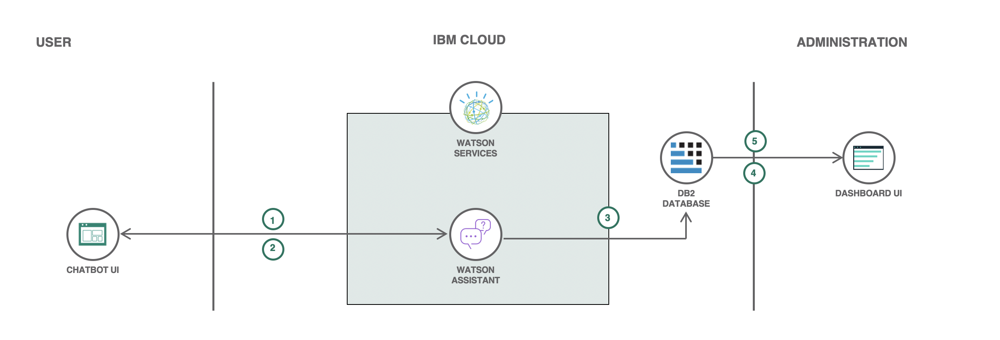


## Flow

1. Feed the data to Watson Assistant service.
2. Convert the text into Intents, Entities & enable conversation.
3. Extract the order & customer details from the text.
4. These extracted attributes gets stored on Db2 database on cloud.
5. Visualize the order and customer details from the input text on a dashboard.


# Watch the Video

[](https://www.youtube.com/watch?v=vTwmCrSZr_k)

## Pre-requisites

* [IBM Cloud account](https://www.ibm.com/cloud/): Create an IBM Cloud account.

# Steps

Please follow the below to setup and run this code pattern.

1. [Clone the repo](#1-clone-the-repo)
1. [Setup Watson Assistant](#2-setup-watson-assistant)
1. [Import the skill](#3-import-the-skill)
1. [Review the skill](#4-review-the-skill)
1. [Update the skill](#5-update-the-skill)
1. [Setup IBM Db2](#6-setup-ibm-db2)
1. [Add the Credentials to the Application](#7-add-the-credentials-to-the-application)
1. [Deploy the Application to Cloud Foundry](#8-deploy-the-application-to-cloud-foundry)
1. [Analyze the results](#9-analyze-the-results)


### 1. Clone the repo

Clone the `online_order_processing_during_pandemics` repo locally. In a terminal, run:

```bash
$ git clone https://github.com/IBM/online_order_processing_during_pandemics
```

### 2. Setup Watson Assistant

Create [Watson Assistant service](https://cloud.ibm.com/catalog/services/watson-assistant)

In Watson Assistant resource page, click on `Service credentials` and create `New credential` per below.

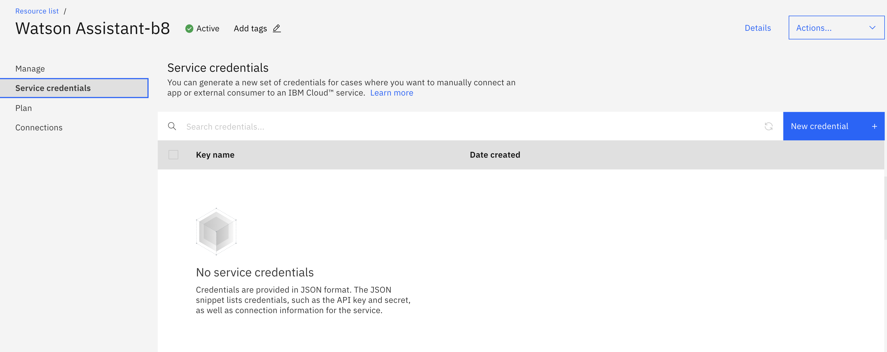

These credentials have to be saved for future reference in this code pattern.

### 3. Import the skill 

In Watson Assistant resource page, click on `Manage` and hit `Launch Watson Assistant` per below.


After the service is launched, we can either create or import the skill. Navigate to the folder `assistant_skill` in this repo and download the file by name `Order_Processing_Skill.json `into your local system. In this code pattern, we have the skill created for you which includes well defined Intents, Entities & Dialog flows which can be ingested into any Watson Assistant service. Click on `Import` as per below.

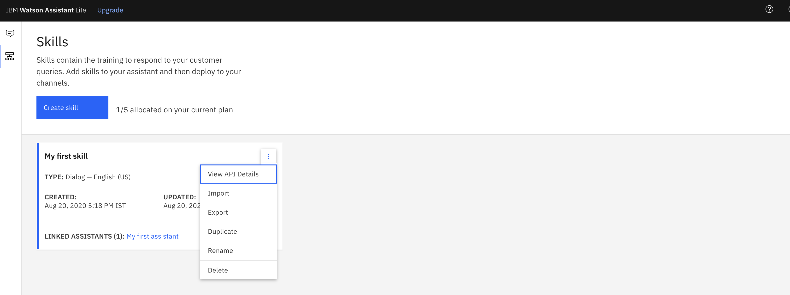

We need to click and select the file `Order_Processing_Skill.json` and hit `Import`

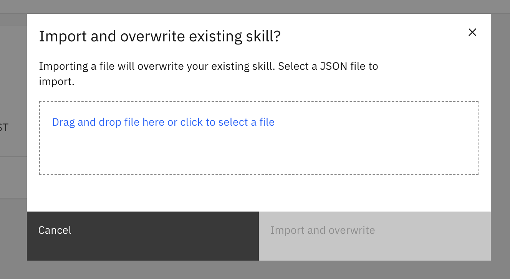

The file is imported in less than a minute and we should see the confirmation per below.

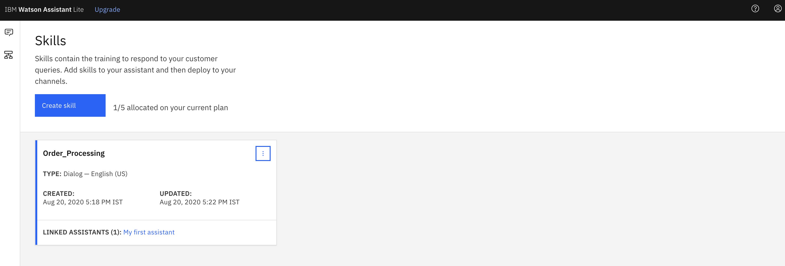

### 4. Review the skill

After the skill is imported, we should click on the skill to review the `Intents, Entities & Dialog` options which is on the left hand side of the screen. There are other features available like `Autocorrection, Irrelevance Detection, Disambiguation, Webhooks` which can be used to enhance the skill. We can `Import, Export or Delete` Intents by clicking on the options towards the right hand side of the screen. 


### 5. Update the skill

We can optionally click on `Try it` on the top right hand side to launch a GUI where we can fire the questions and evaluate the response accordingly. This step will be helpful to make changes to Intents, Entities and/or Dialog flows by making the conversation interactive & meaningful. 

We can update the Intents, Entities & Dialog flows in three different ways. One is to do it manually, second is to import a text file with the details and the third is to make changes dynamically using a code. Navigate to the `code` folder to access the Python script for making dynamic changes to Intents & Entities. After we run the script using Jupyter Notebook in Watson Studio, it will take couple of minutes for Watson Assistant to train on new data. The training time is dependent on the amount of new data which is being exposed to Watson Assistant.

### 6. Setup IBM Db2

- Create a [Db2 service](https://cloud.ibm.com/catalog/services/db2).


- Click on **Service credentials** and click on **New Credentials** to generate credentials and click on save credentials as shown.


### 7. Add the Credentials to the Application

- Open the `watson-assistant-credentials.json` file and add the Watson Assistant `apikey`, `url` and the `assistant-id` from step #2 in the placeholders and finally save the file.

```json
{
    "apikey": "<YOUR_API_KEY_HERE>",
    "url": "<URL_HERE>",
    "assistant-id": "<ASSISTANT_ID_HERE>"
}
```

- Open the `ibm-db2-credentials.json` file and paste the Db2 Credentials and save the file.

### 8. Deploy the Application to Cloud Foundry

* Make sure you have installed [IBM Cloud CLI](https://cloud.ibm.com/docs/cli?topic=cloud-cli-getting-started&locale=en-US) before you proceed.

* Log in to your IBM Cloud account, and select an API endpoint.
```bash
$ ibmcloud login
```

>NOTE: If you have a federated user ID, instead use the following command to log in with your single sign-on ID.
```bash
$ ibmcloud login --sso
```

* Target a Cloud Foundry org and space:
```bash
$ ibmcloud target --cf
```

* From within the _cloned directory_ push your app to IBM Cloud.
```bash
$ ibmcloud cf push
```

* Once Deployed You will see output on your terminal as shown, verify the state is _`running`_:

<pre><code>Invoking 'cf push'...

Pushing from manifest to org manoj.jahgirdar@in.ibm.com / space dev as manoj.jahgirdar@in.ibm.com...

...

Waiting for app to start...

name:              order-processing-pandemic
requested state:   started
routes:            <b>order-processing-pandemic.xx-xx.mybluemix.net </b>
last uploaded:     Sat 16 May 18:05:16 IST 2020
stack:             cflinuxfs3
buildpacks:        python

type:            web
instances:       1/1
memory usage:    256M
start command:   python app.py
     state     since                  cpu     memory           disk           details
#0   <b>running</b>   2020-05-16T12:36:15Z   25.6%   116.5M of 256M   796.2M of 1
</code></pre>

* Once the app is deployed you can visit the `routes` to view the application.

### (Optional) Run Locally
<details><summary> Instructions</summary>

>Note: If you prefer to run the application locally, you can follow the steps below. Please note that IBM Db2 will not work locally only the chatbot can be used.

- In the cloned directory, run the following command to build the **dockerfile.**

```bash
$ docker image build -t covid-19-helpdesk .
```

- Once the **dockerfile** is built, run the following command to start the application.

```bash
$ docker run -p 8080:8080 covid-19-helpdesk
```

- The application will be available on <http://localhost:8080>

</details>

### 9. Analyze the results

- Visit the app route `order-processing-pandemic.xx-xx.mybluemix.net` to launch the chatbot.

- Click on `Place an order` to place online order with the watson assistant chatbot as shown. `This app can be used to place orders for essentials like grocery, medicines etc by providing appropriate response to the questions.`

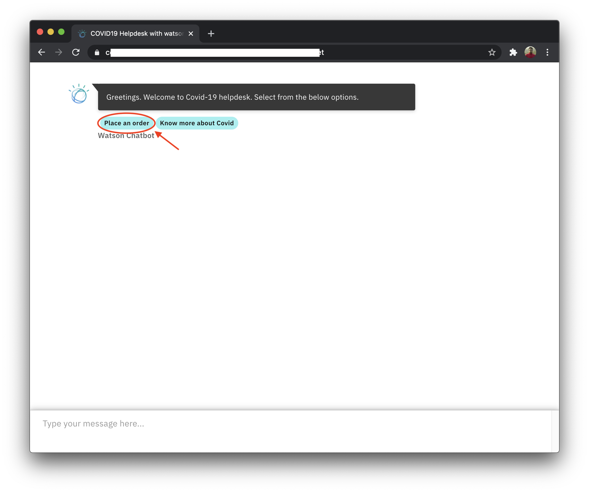

- A Template will be available for selecting some of the products quickly as shown or If you have a different set of products then click on `cancel` and enter your own products and quantities together as comma separated values. 
    
    1. Select any products of choice from the quick select menu. 
    2. Input the quantity.
    3. Click on `Confirm`.

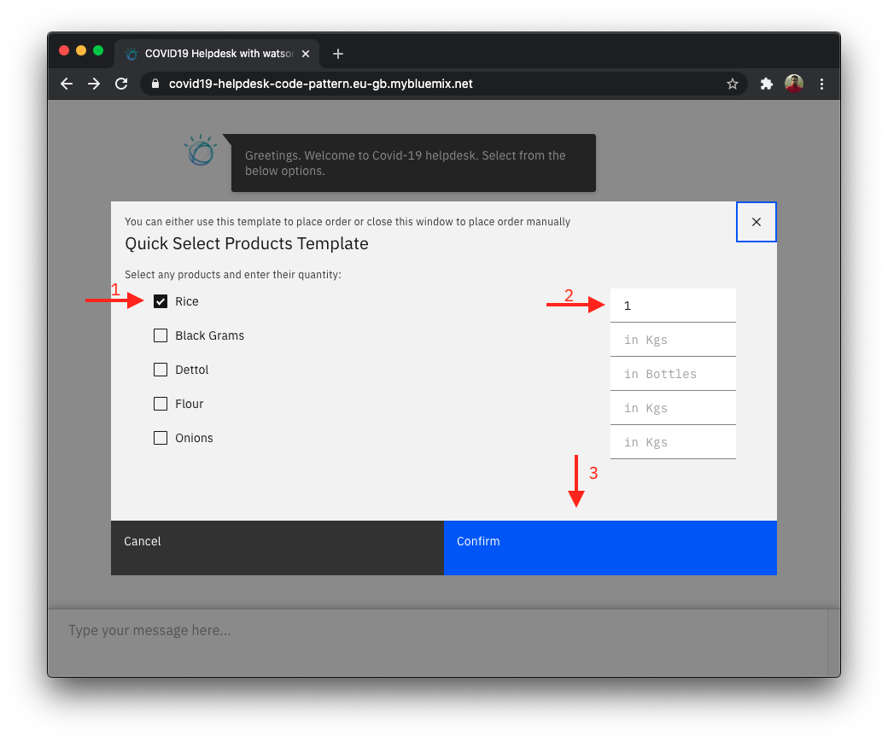

- The orders will be processed one after the other please wait for it to complete.


- The chatbot will ask for location permission, kindly allow the permission by clicking the `Allow` button as shown.

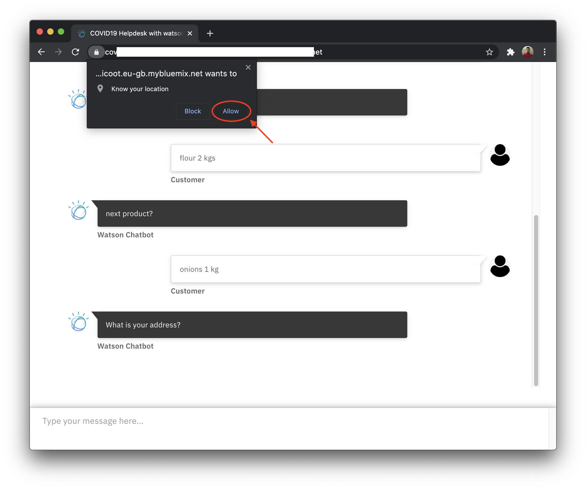

- This will automatically detect your location close to 65% accuracy. If you are satisfied with the address you can click on `Yes proceed with the address` as shown or if you want to enter your address by yourself you can click on `No I will enter my address` and enter your address.

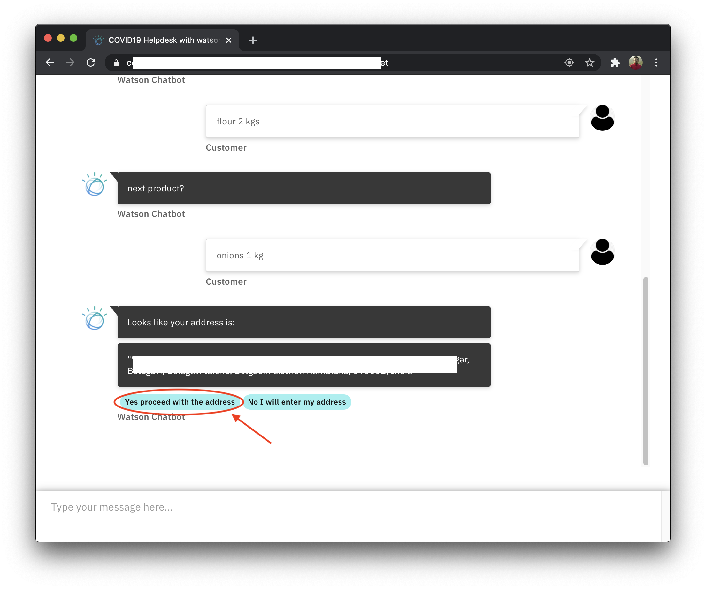

- Provide your `Name` and `Contact Number` and you will get a thank you message with the order details as shown.

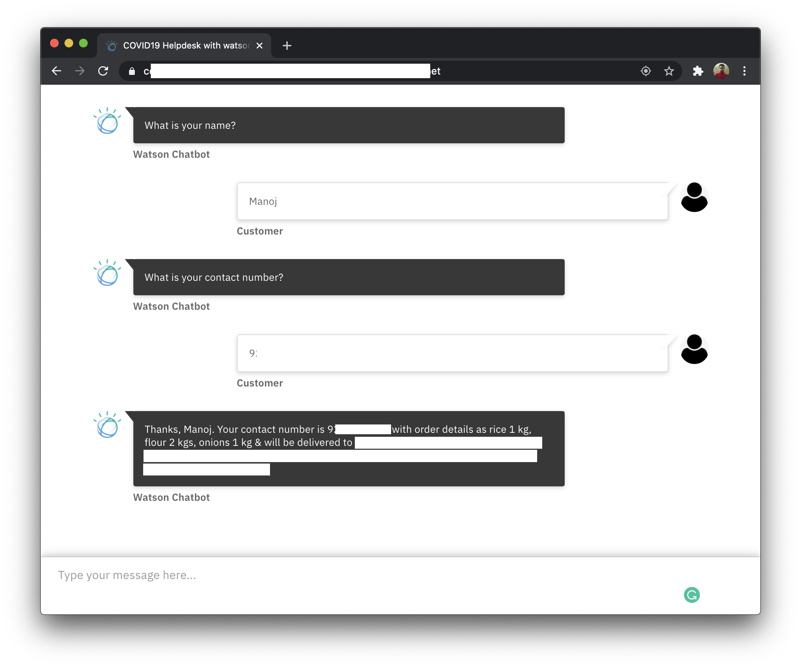

- You have successfully placed an order at this point, your order will be saved to Db2 database.

>- Aditionally you can click on `Know more about Covid` as shown.

>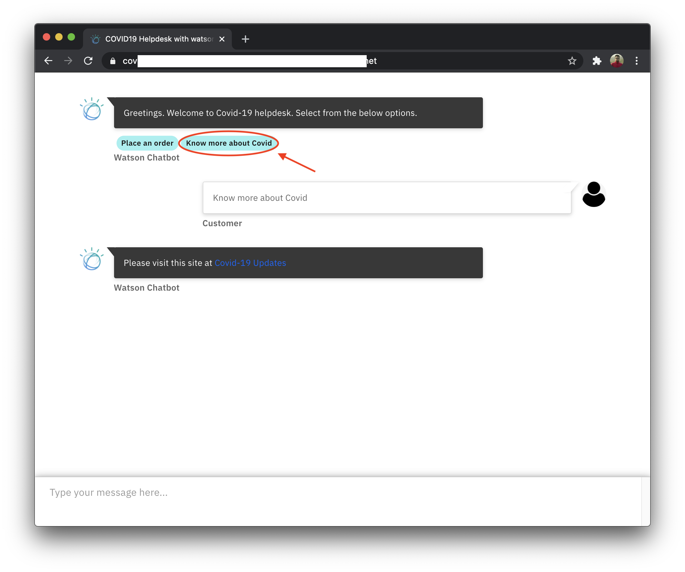

- From an Admin prespective visit the app route `order-processing-pandemic.xx-xx.mybluemix.net` followed by `/dashboard` for example: `order-processing-pandemic.xx-xx.mybluemix.net/dashboard` and you can view all the user placed orders here as shown.

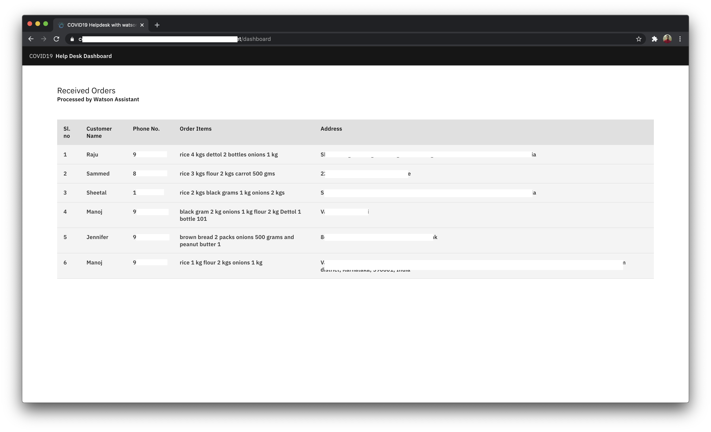

We have learnt how to set up automated order processing & inventory management system using Watson Assistant & IBM DB2. This solution can be further enhanced by integrating with IBM Sterling service. 

## License

This code pattern is licensed under the Apache License, Version 2. Separate third-party code objects invoked within this code pattern are licensed by their respective providers pursuant to their own separate licenses. Contributions are subject to the [Developer Certificate of Origin, Version 1.1](https://developercertificate.org/) and the [Apache License, Version 2](https://www.apache.org/licenses/LICENSE-2.0.txt).

[Apache License FAQ](https://www.apache.org/foundation/license-faq.html#WhatDoesItMEAN)
