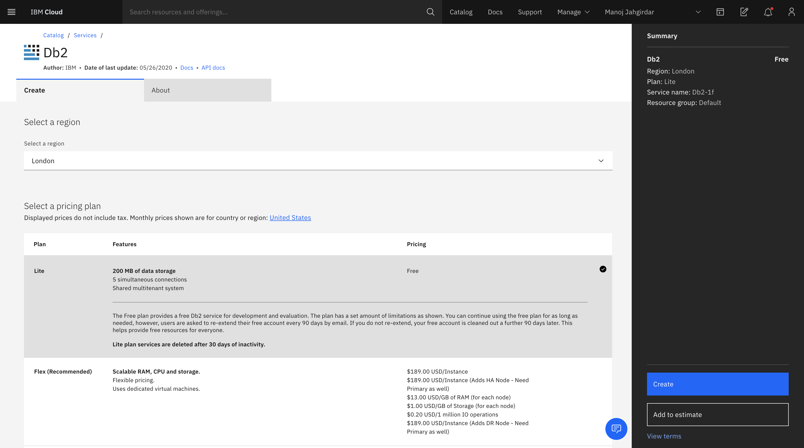

### 1. Clone the repo

Clone the `online_order_processing_during_pandemics` repo locally. In a terminal, run:

```bash
$ git clone https://github.com/IBM/online_order_processing_during_pandemics
```
### 2. Setup IBM Db2

- Create a [Db2 service](https://cloud.ibm.com/catalog/services/db2).



- Click on **Service credentials** and click on **New Credentials** to generate credentials and click on save credentials as shown.


### 3. Add the Credentials to the Application

- Open the `credentials.json` file and add the Watson Assistant `apikey`, `url` and the `assistant-id` in the placeholders and finally save the file.

```json
{
    "apikey": "<YOUR_API_KEY_HERE>",
    "url": "<URL_HERE>",
    "assistant-id": "<ASSISTANT_ID_HERE>"
}
```

- Open the `credentials1.json` file and paste the Db2 Credentials and save the file.

### 4. Deploy the Application to Cloud Foundry

* Make sure you have installed [IBM Cloud CLI](https://cloud.ibm.com/docs/cli?topic=cloud-cli-getting-started&locale=en-US) before you proceed.

* Log in to your IBM Cloud account, and select an API endpoint.
```bash
$ ibmcloud login
```

>NOTE: If you have a federated user ID, instead use the following command to log in with your single sign-on ID.
```bash
$ ibmcloud login --sso
```

* Target a Cloud Foundry org and space:
```bash
$ ibmcloud target --cf
```

* From within the _cloned directory_ push your app to IBM Cloud.
```bash
$ ibmcloud cf push
```

* Once Deployed You will see output on your terminal as shown, verify the state is _`running`_:

<pre><code>Invoking 'cf push'...

Pushing from manifest to org manoj.jahgirdar@in.ibm.com / space dev as manoj.jahgirdar@in.ibm.com...

...

Waiting for app to start...

name:              order-processing-pandemic
requested state:   started
routes:            <b>order-processing-pandemic.xx-xx.mybluemix.net </b>
last uploaded:     Sat 16 May 18:05:16 IST 2020
stack:             cflinuxfs3
buildpacks:        python

type:            web
instances:       1/1
memory usage:    256M
start command:   python app.py
     state     since                  cpu     memory           disk           details
#0   <b>running</b>   2020-05-16T12:36:15Z   25.6%   116.5M of 256M   796.2M of 1
</code></pre>

* Once the app is deployed you can visit the `routes` to view the application.


### 5. Run Locally (optional)

>Note: If you prefer to run the application locally, you can follow the steps below. Please note that IBM Db2 will not work locally only the chatbot can be used.

- In the cloned directory, run the following command to build the **dockerfile.**

```bash
$ docker image build -t covid-19-helpdesk .
```

- Once the **dockerfile** is built, run the following command to start the application.

```bash
$ docker run -p 8080:8080 covid-19-helpdesk
```

- The application will be available on <http://localhost:8080>